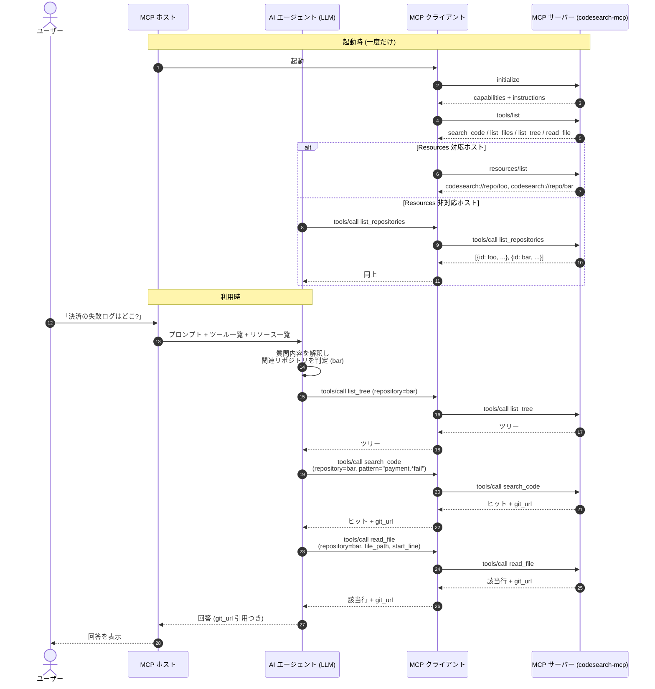

# エージェント連携シーケンス

本書は AI エージェント (LLM) が本 MCP サーバーを利用するときの相互作用を
俯瞰するための文書である。仕様書 (`spec/spec.md`) と
LLM 向け文言の原本 (`usage-for-llm.md`) を読む際の補助線として読まれることを
想定する。

ここでは設定済みリポジトリが `foo` と `bar` の 2 つあるケースを例に、
「なぜエージェントが本サーバーを呼ぶのか」「`foo` と `bar` のどちらを
参照すべきと判断するのか」を順を追って説明する。

## 1. 登場人物

| 名称 | 役割 | 例 |
| --- | --- | --- |
| ユーザー | 自然言語で要求を出す人 | 開発者 |
| MCP ホスト | LLM を実行し、MCP クライアント機能を内包するアプリケーション | Claude Code、Claude Desktop、IDE 拡張 |
| AI エージェント | ホスト内で動く LLM。ツール呼び出しを発行する主体 | Claude / GPT-4 等 |
| MCP クライアント | ホスト内で MCP サーバーとの JSON-RPC 接続を管理する層 | ホスト実装の一部 |
| MCP サーバー | 本実装 (`codesearch-mcp`) | stdio / Streamable HTTP で待機 |

「AI エージェント」と「MCP クライアント」は同じプロセス内に同居する。
両者を分けるのは、判断主体 (LLM) と通信主体 (プロトコル実装) が
責務として別であることを明確にするためである。

## 2. 全体シーケンス

`foo` と `bar` が設定済みで、ユーザーが「決済が失敗したときに
ログを出している箇所はどこ?」と尋ねた場面を例にする
(`foo` がフロントエンド、`bar` がバックエンドという想定)。



数字付きの実線が JSON-RPC 呼び出し、点線が応答である。
点で囲った領域 (起動時 / 利用時) は時間軸上の局面を示す。

## 3. なぜエージェントは本 MCP を呼ぶのか

LLM はホストから渡されたコンテキストだけを根拠に判断する。
ホストは MCP サーバーから次の 3 つを取得し、LLM のシステムプロンプトに
合成する。

1. **Server instructions** (`initialize` 応答の `instructions` フィールド)
   本サーバーは「Git 管理されたソースコードを調べたいときに使う」
   という用途宣言と、推奨ワークフロー (`resources/list` →
   `list_tree` → `search_code` → `read_file`) を返す。
   実文言は `usage-for-llm.md` の "Server instructions" 節を参照。
2. **各ツールの `description`** (`tools/list` 応答)
   個々のツールが「いつ使うか」「他のツールとの使い分け」を 1 段落で
   宣言する。例えば `search_code` は「distinctive token を全箇所
   見つけたいとき」と明示している。
3. **各リソースの `description`** (`resources/list` 応答)
   設定済みリポジトリそれぞれに 1〜2 文の説明が付く
   (仕様書 §4.5.2)。

これらは LLM から見れば「使える道具のカタログ」である。
ユーザー質問が「ソースコードを横断的に探す系」だと推定できれば、
LLM は本サーバーのツールを呼ぼうとする。
逆に「自然言語の意味検索が欲しい」「コードを生成してほしい」と
読み取れる場合、本サーバーの instructions に
「NOT do」リスト (semantic search, code generation 等) が明記されている
ので、LLM は他の手段を選ぶ。

ホスト側が複数 MCP サーバーを束ねている環境では、各サーバーの
instructions / description の表現力がそのまま選択精度に直結する。
本サーバーが冗長気味でも具体的な「使うとき/使わないとき」を書いている
のはこのためである。

## 4. `foo` と `bar` のどちらを参照するかの判断

ツール引数の `repository` を埋めるには「どちらを見るべきか」を
エージェントが決めなければならない。判断材料は次の 4 段である。

### 4.1 リポジトリ一覧と description

エージェントが「どんなリポジトリが使えるか」を知る経路は 2 つある。

- **`resources/list`** — Resources capability に対応するホスト向け。
  各エントリには `description` が含まれる (仕様書 §4.5.2)。
- **`list_repositories` ツール** — Resources をエージェントに見せない
  ホスト向けの fallback (仕様書 §2.3)。返るオブジェクトに同等の
  説明文を含める。

どちらの経路でも、`repos.toml` を書く時点で
**何のリポジトリか** を 1〜2 文で書いておくことが、エージェントに
正しい選択をさせる最大の手段である。description のボリューム目安と
書き方の指針は `installation.md` の
「リポジトリ description の設計」節を参照。

例 (`resources/list` 応答の抜粋):

```json
[
  {
    "uri": "codesearch://repo/foo",
    "title": "foo",
    "description": "Frontend SPA. React + TypeScript. UI 部品と API クライアント"
  },
  {
    "uri": "codesearch://repo/bar",
    "title": "bar",
    "description": "Backend API. Python + FastAPI. 決済・認証・通知のドメインロジック"
  }
]
```

ユーザー質問に「決済」「ログ」というキーワードがある場合、
LLM は description の「決済」と「バックエンド」から `bar` を
第一候補として選ぶ。

### 4.2 リソース読み取りによる鮮度確認 (任意)

`resources/read codesearch://repo/bar` を呼ぶと
`status.state` (`uninitialized` / `ready` / `failed`)、
`status.last_sync_at`、`status.last_commit` が返る
(仕様書 §4.5.3)。
鮮度が問われる質問 (例: 「昨日入った変更」) では読み取って確認する。
通常の検索では省略してよい。

### 4.3 質問内容からの推定

description が不十分でも、LLM はユーザー発話と
リポジトリ ID 自体からヒューリスティックに判断できる
(例: `bar-backend` という ID なら「backend」を読み取る)。
ただし ID は `^[a-zA-Z0-9._-]+$` の自由文字列であり、
意味が乗っているとは限らない。description の充実度の方が
信頼性が高い。

### 4.4 不明時のフォールバック

判断がつかない場合のエージェントの取りうる戦略は 3 つある。

| 戦略 | 内容 | 使いどころ |
| --- | --- | --- |
| 並列探索 | `foo` と `bar` の両方に `list_tree` または `search_code` を投げ、ヒットしたほうを採用 | 軽量な検索でコストが低いとき |
| 構造観察 | `list_tree` を両方に呼んで言語/フレームワークを推定 | description が極端に薄いとき |
| ユーザーに尋ねる | ホスト UI で「どちらを見ますか?」を表示 | 上記でも決め手がないとき |

並列探索は `search_code` の `output_mode=files_with_matches` や
`output_mode=count` でコストを下げられる
(`usage-for-llm.md` の `search_code` ツール節参照)。

## 5. 失敗時の挙動

ツール呼び出しは `isError: true` の tool result としてドメイン失敗を
返す (仕様書 §5)。エージェントが想定しておくべき主なケース:

| エラーコード | 想定対応 |
| --- | --- |
| `REPO_NOT_READY` | 初回 clone 中。少し待って再試行、または別リポジトリに切り替え |
| `REPO_NOT_FOUND` | ID 誤り。`resources/list` を再取得 |
| `INVALID_PATH` / `PATH_NOT_FOUND` | パスを LLM 側で修正 |
| `TIMEOUT` | 検索条件を絞る (`glob`、`type`、`path`) |
| `FILE_TOO_LARGE` / `FILE_BINARY` | `read_file` の前に `search_code` で対象行を絞る |

`REPO_NOT_READY` は「1 つのリポジトリの失敗が他に波及しない」設計
(CLAUDE.md "Per-repo isolation") に守られており、
`foo` が `REPO_NOT_READY` でも `bar` は通常通り使えることが保証される。

## 6. 関連文書

- `usage-for-llm.md` — Server instructions / Tool description /
  Resource description の英語原文 (LLM が実際に受け取るテキスト)
- `spec/spec.md` §4.5 — Resources の URI 規約と JSON 形式
- `spec/spec.md` §5 — エラーコード一覧
- `design/design.md` — `RepositoryManager` と sync の内部設計
- `installation.md` — `repos.toml` の初期セットアップと
  description の設計指針
- `operations.md` — 同期トリガ、HTTP 公開、配備パターン
